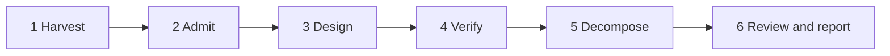
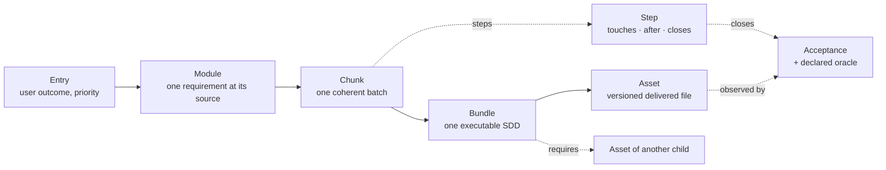
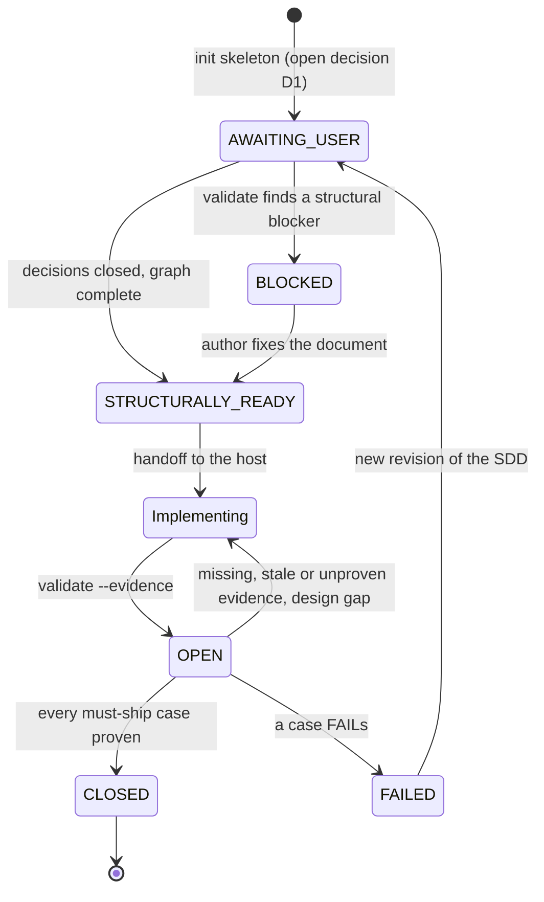
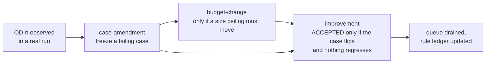

# create-sdd

**English** | [简体中文](README.zh-CN.md)

create-sdd is an agent skill that turns a request into a **Software Design Document (SDD) a coding agent can implement and a machine can check**. It writes, refactors, merges or audits an `sdd/v2` document. That document goes **directly to your coding host** (Claude Code, Codex or any other agent). The host implements it and reports evidence, and `validate --evidence` decides whether the delivery converged on the design.

This README explains the skill. [SKILL.md](SKILL.md) is the normative contract; where the two differ, SKILL.md wins.

<p align="center">
  
</p>

| Capability | Score | What it rests on |
| --- | --- | --- |
| Host implementability | 9 | A compact handoff: read order, ordered tasks with the files they touch, the MVP task set and a per-Bundle execution slice |
| Requirement traceability | 9 | Every must-ship requirement is traced through Module, Chunk and Bundle to an observable acceptance and its declared oracle |
| Verifiable convergence | 9 | Evidence reports, commit-checked causal proof, `--replay` ablation and a `preserve` class for properties that already hold |
| Design-defect detection | 6 | Structural checks are exact. The semantic checks (acceptance quality, readers, symbols) are regex-based advice; a fresh-context review, measured outside the skill, reads for cross-clause conflicts and weak acceptance |
| Context economy | 8 | The host reads one child and its direct dependencies; derived Metas keep the index short |
| Repository fit | 8 | `AGENTS.md` and principle files, repository presets, shareable preset packs and custom `init` templates |
| Host neutrality | 8 | Works with Claude Code, Codex or any agent that reads a skill folder; the scripts need Bun |
| Ease of adoption | 6 | There are many concepts to learn and Bun is required; a skeleton and the handoff shorten the first run |

The scores are the author's own judgement of the current version, on a 0–10 scale where higher is better, including for ease of adoption.

---

## Quick start

**Install.** One command clones the skill once into `~/.create-sdd` and links it into the skill directory of each coding agent you name with `--host`. Use whichever runner you already have; every one of them runs the same installer:

```bash
curl -fsSL https://raw.githubusercontent.com/migaia/sdd-generate/main/install.sh | bash -s -- --host claude --host codex
```

```bash
npx @migaia/sdd-generate --host claude --host codex
```

```bash
pnpm dlx @migaia/sdd-generate --host claude,codex
```

```bash
bunx @migaia/sdd-generate --host claude,codex
```

```bash
aubx @migaia/sdd-generate --host claude,codex
```

`--host` is repeatable and accepts a comma-separated list; bare ids (`bash -s -- claude codex`) work too. Without the npm registry, `npx github:migaia/sdd-generate --host claude` (or `pnpm dlx github:…`) runs the installer straight from GitHub.

| Agent | Argument (aliases) | Skill directory |
| --- | --- | --- |
| Claude Code | `claude` (`claude-code`) | `~/.claude/skills` (`$CLAUDE_CONFIG_DIR`) |
| OpenAI Codex | `codex` | `~/.codex/skills` (`$CODEX_HOME`) |
| Cursor | `cursor` | `~/.cursor/skills` |
| GitHub Copilot (CLI, VS Code, JetBrains) | `copilot` (`github-copilot`) | `~/.copilot/skills` |
| OpenCode | `opencode` | `~/.config/opencode/skills` |
| Pi coding agent | `pi` | `~/.pi/agent/skills` |
| Kimi Code CLI | `kimi` (`kimi-code`) | `~/.kimi-code/skills` (`$KIMI_CODE_HOME`) |
| ZCode (Zhipu) | `zcode` | `~/.zcode/skills` |
| Devin for Terminal | `devin` | `~/.config/devin/skills` |
| TRAE | `trae` | `~/.trae/skills` |
| TRAE CN | `trae-cn` | `~/.trae-cn/skills` |
| Doubao | `doubao` | `~/.doubao/skills` |
| Gemini CLI | `gemini` | `~/.gemini/skills` |
| Qwen Code | `qwen` | `~/.qwen/skills` |
| Windsurf | `windsurf` | `~/.codeium/windsurf/skills` |
| Any agent that reads the shared Agent Skills directory | `agents` (`universal`) | `~/.agents/skills` |

- Running the command again updates the clone, and with it every linked agent.
- `--list` prints the table with the paths resolved on your machine.
- `--ref <tag>` installs a specific version.
- `--copy` copies the skill instead of linking it, for agents that do not follow symlinks.
- A real directory already at a target path is never removed; the script reports it and skips that agent.
- The installer needs bash and git (on Windows, use WSL or Git Bash). The skill's scripts need [Bun](https://bun.sh). They use only built-in modules, except `type-probe.ts`, which needs `bun install` for TypeScript.

**Invoke.** Ask for the outcome and name the repository: `/create-sdd` in Claude Code or `$create-sdd` in Codex. The skill picks the mode, writes the document and stops before implementation unless you asked for that too.

| You want | Mode | Result |
| --- | --- | --- |
| A feature or change | feature (default) | `sdd/v2` leaf |
| A bug fixed | bug (`intent: bug`) | Reproduction, root cause and regression acceptance |
| To decide whether an idea is worth doing | assessment | `sdd-assessment/v1`: go, no-go or reshape; a go seeds the SDD's Entries |
| Several independently owned outcomes | program | `sdd-program/v2` root plus one child SDD per outcome |
| A review of an existing SDD or its implementation | audit | Findings only, no rewrite unless asked |

**One full round, by hand.** `$SKILL` is the install path (`~/.create-sdd` after the installer); paths must be absolute.

```bash
bun $SKILL/scripts/init.ts --kind feature --out /repo/docs/greeting.sdd.md
```

```bash
bun $SKILL/scripts/validate.ts validate --sdd /repo/docs/greeting.sdd.md
```

```bash
bun $SKILL/scripts/init.ts --kind evidence --sdd /repo/docs/greeting.sdd.md --out /repo/docs/greeting.evidence.json
```

```bash
bun $SKILL/scripts/validate.ts validate --sdd /repo/docs/greeting.sdd.md --evidence /repo/docs/greeting.evidence.json --replay
```

1. `init` writes a skeleton that validates as `AWAITING_USER`.
2. You (or the agent) replace its placeholders and answer the open decisions.
3. `validate` reports `STRUCTURALLY_READY` and returns the host handoff.
4. The host implements, committing each step with its step ID (`S2: add farewell`).
5. The host fills the evidence report that `init --kind evidence` created.
6. `validate --evidence` computes the closure.

## Platforms

**Agent hosts.** The skill is host-neutral. Claude Code and Codex are the daily hosts, and any agent that can read a skill folder and run Bun works the same way. There is no delivery controller, lease or fixed agent role: the SDD and the `validate` handoff are the whole interface between design and implementation.

**Runtime.** Bun runs every script. Git is read, never written, for proofs and replays. `--replay` exports trees with `git archive` and runs the declared oracle with a runner derived from the repository (`bun test`, `vitest`, `jest`, `pytest`, `go test`) or named by the preset.

**Products and languages.** For the design phase, the skill loads fact guides only when they are in scope:
- *Platforms:* mini program, iOS/Android, Flutter, HarmonyOS (ArkTS), desktop and native SDK.
- *Languages:* Rust, Go, Python, Bun/Node and JVM.
- *Topics:* UI experience contracts, content sites, TypeScript toolchains, and core-and-adapter architecture.

[references/loading.md](references/loading.md) maps each condition to its guide.

---

## Philosophy

### What the design optimizes for

The reader of an SDD is an implementing agent. The document is written so that the agent reads less context and makes fewer unstated decisions. It should be able to follow each requirement through its steps to an acceptance case, and to find the owner of every supported boundary. Five principles follow from that:

- **One authority per fact.** The Markdown body is normative. The JSON index stores only IDs, paths, versions and relations. A repository convention or principle file is referenced by path, never copied.
- **A fixed trade-off order:** usability and implementability > measured performance > feature breadth > test machinery >> optional hardening. Abstraction and defensive machinery need a current requirement or a demonstrated failure.
- **The user's scope is a hard boundary.** Tests serve business outcomes and are not the deliverable. Adjacent defects are recorded, never promoted to must-ship work.
- **Honest limits.** Every result carries `evidence_limits`. A structurally ready SDD is not proof of a good design, and it grants no authority to commit, merge or deploy.
- **Measured change.** The skill changes only through recorded rounds that repair a frozen failing case (see [the skill's own lifecycle](#the-skills-own-lifecycle)).

### Six phases

Every document is written in the same order. The phases are a reasoning order, not six tool calls, receipts or agent roles. Each one closes a specific way that designs go wrong.



| Phase | Question | Produces | Prevents |
| --- | --- | --- | --- |
| **1 Harvest** | What is actually true here? | Facts classified `USER_STATED`, `OBSERVED`, `INFERRED` or `ASSUMED` (only the first two are normative); resolved repository and output paths; `principles` by path | Designing against imagined code, invented owners or commands |
| **2 Admit** | What outcome, for whom, and why? | Prioritized, independently acceptable Entries; measurable success criteria; open points as `[NEEDS CLARIFICATION: D1 …]`, asked in one batch; the choice of one SDD or a program | Scope creep, and technology decisions made before the problem is settled |
| **3 Design** | How, under the principles? | Normative behaviour, steps with `touches`, producer and consumer interfaces, supported failures, and one owner per change boundary | Two owners for one boundary; steps the host has to invent |
| **4 Verify** | How would we notice it is missing? | A Given/When/Then or command case for each must-ship requirement, its deciding test in `oracles`, and the resolved acceptance-quality candidates | Acceptance that passes against the old code; unobservable assertions |
| **5 Decompose** | In what order, and what can run in parallel? | The five-Meta graph; batches ordered by real dependencies; parallel waves derived, never hand-marked | Hand-maintained task lists that drift from the design |
| **6 Review and report** | What would the host hit mid-delivery, and what can it rely on? | A fresh-context review with a disposition for every finding (when a must-ship requirement or a BC exists), then one `validate` run and a handoff with blockers, open decisions and evidence limits | Clauses that cannot all hold, acceptance a wrong implementation passes, and readiness claimed on unrun checks |

A bug fix runs the same six phases, adding a reproduction, a root cause and `regression` cases that must fail before the fix. An assessment runs Harvest and Admit only, then decides go, no-go or reshape.

### Five Metas

The five Metas are the **relation graph** between the user's outcomes and the delivered files. They are not five document levels and not an execution role system. Each one points back to a normative anchor in the prose.



| Meta | Carries | Rule |
| --- | --- | --- |
| **Entry** | A user story with a priority (`P1`, `P2`, …) | The highest priority present is the MVP; the handoff computes the smallest task set that closes it |
| **Module** | One requirement at its authoritative source (`source_id`), plus its original identity (`origin`) | Keeps a requirement's identity when an SDD is split or merged |
| **Chunk** | One batch of steps and the Modules it serves | Chunk layers by batch dependency become the derived parallel waves |
| **Bundle** | One executable SDD: its Chunks, its `reads` and the Assets it `requires` | The unit a host takes; its `requires` make cross-child dependencies concrete |
| **Asset** | A versioned delivered file or directory, its producing Bundle and the acceptance that observes it | Only for real outputs, never invented for work that produces none |

Every must-ship requirement must reach an observable acceptance through Module, Chunk and Bundle, or `validate` blocks with `SDD_V2_MUST_SHIP_CHAIN_INCOMPLETE`. In a one-document leaf, any omitted kind is derived (`M:R1`, `K:C1`, `B:self`, `E:self`). A program root may omit its children's Modules, Chunks and Bundles too (`M:<child>:<R>`, `K:<child>:<C>`, `B:<child>`), so a child edit never forces a hand-copied root index. You declare only what adds information: prioritized Entries and delivered Assets.

### Lifecycle

An SDD has a lifecycle that runs from skeleton to closed delivery, and every transition is decided by a check rather than by a claim.



- **Maturity.** `validate` returns `BLOCKED`, `AWAITING_USER` (an open `[NEEDS CLARIFICATION]` decision) or `STRUCTURALLY_READY`. A skeleton always starts at `AWAITING_USER`, so it can never be handed over as a finished design.
- **Handoff.** The host receives:
  - the root summary and the target child with its direct dependencies;
  - a read order;
  - ordered `tasks` with the files they touch and their safe parallelism;
  - the MVP task set;
  - advisory `candidates`.
- **Evidence.** The host writes an `sdd-evidence/v1` report outside the SDD, with one row per acceptance for the SDD's current `id@revision`. A report for another revision is stale.
- **Proof.** A PASS row alone proves only that a check passed.
  - *Change acceptance* must show the same command failing at a base commit and passing at the change. The base must be an ancestor, and the change must touch the files that implement the case.
  - *Preservation acceptance* is listed in `preserve`. It covers a property that already holds and must still hold, such as golden equivalence or an unchanged public surface. It shows PASS at base and PASS at change, and never a manufactured failure.
  - A PASS baseline on an unlisted case, or a FAIL baseline on a listed one, keeps the closure `OPEN`.
- **Replay.** `--replay` stops trusting the host's runs. It runs the declared oracle itself in exported trees:
  - at base, where it must fail;
  - at the change, where it must pass;
  - at the change with only this requirement's commits reverted, where it must fail again (the ablation).
- **Revision.** A FAIL, or a changed expectation, becomes a new revision of the SDD, and the lifecycle starts again from the document.


### The skill's own lifecycle

The checks themselves follow a lifecycle, so they change only when a real run proves they need to.



1. A defect that a real delivery found, and that the checks missed, is recorded as an `OD-n` entry in `rsi/observed-defects.md`.
2. A `case-amendment` round freezes a failing case for it.
3. If the size budget must move, a separate `budget-change` round records the measured need.
4. An `improvement` round is `ACCEPTED` only if the frozen case flips and no earlier case regresses.
5. Every new rule records what it supersedes, a counterexample, its scope and its trade-off.
6. A semantic defect that no zero-false-positive regex can catch settles as a review `lens`, not as a detector. The settlement must name a review round that `sdd-bench` accepted (`settle --as lens --review-results <rounds.json>`); a written `ruling` or a `rejected` settlement records the other outcomes.

---

## Mechanisms

**The `sdd/v2` contract.** A document is Markdown prose plus one compact JSON index between `<!-- sdd-contract:start -->` and `<!-- sdd-contract:end -->`. The index holds requirements, batches, steps, acceptance, `oracles`, `writes`, Metas, `exports`/`consumes`, `regression`, `preserve` and open user decisions. Each ID must be defined exactly once in the prose. ([contract](references/v2-contract.md))

**The `validate` handoff.** A single command performs the structural check and emits the host handoff. The handoff contains the resolved paths, read order, ordered `tasks`, derived `waves`, the MVP and its minimal task set, the execution slice (Chunks, Modules, required and produced Assets) and `evidence_limits`.

**Advisory candidates.** Some findings are advice rather than blockers, because a regular expression cannot decide semantics. They come in six families:
- *Readers:* tests asserting error text, or code depending on class shape.
- *Symbols:* step calls declared nowhere in owned source.
- *Boundaries:* git-ignored inputs, and writes owned by another SDD.
- *Forward dependencies.*
- *Review:* a recorded finding with no disposition, or one that cites a clause the document does not define.
- *Acceptance quality:*
  - uncovered outcomes;
  - undiscriminating fixtures for quantifiers;
  - oracles below a public boundary;
  - missing invariant or surface inventories;
  - unobservable subjects;
  - removed exports that a test promised unchanged still asserts;
  - unmarked preservation cases;
  - and others.

A preset can promote any candidate to a blocker.

**Pre-handoff review.** Structure cannot see clauses that contradict each other, or acceptance that a wrong implementation still passes. Before the handoff, one reviewer that did not write the document reads the SDD, the repository and [review](references/review.md), and nothing else. It applies three lenses:
- *L1 behaviour-change sweep:* for every BC or rewritten branch, find every test and branch that asserts the old behaviour, and check each pair of clauses on the same cell (for example "the other tests stay unchanged" against a sibling test that asserts the changed behaviour).
- *L2 discrimination:* for every must-ship acceptance, including ones an earlier revision left unchanged, describe a plausible wrong implementation that passes it.
- *L3 implementation dry-run:* walk each step against the code and list every decision the SDD leaves to the host.

Findings go to an `sdd-review-findings/v1` file (`id`, `lens`, `clauses`, `evidence`, `claim`). The author closes each one as `fixed`, `ruled-invalid:<reason>` or `out-of-scope` in the index (`"review": {"findings": …, "dispositions": {"F1": "fixed"}}`), and re-reviews only the changed clauses, once. `validate` reports an undisposed finding or an unknown clause as a candidate, never a blocker. The handoff and the local telemetry carry disposition counts per lens, and `rsi.ts health` turns them into per-lens precision (fixed ÷ (fixed + ruled-invalid)).

The lenses are measured, not asserted. The separate `sdd-bench` scores a lens version on seeded review cases, most of them defects that real deliveries hit. It reports recall, false alarms on the repaired document, recall on held-out cases never used to write a lens, and token cost. A new lens version is accepted only if it catches the case that triggered it, loses nothing, and stays within the cost ceiling.

**Closure.** `validate --evidence` checks, for each acceptance:
- that the PASS row runs the declared oracle;
- the commit-checked proof and its causal diff;
- that promised files and Assets exist at the reported commit;
- that each must-ship requirement changed at least one implementing file.

It returns `CLOSED`, `OPEN` or `FAILED`, together with `behaviour_proven` and `mvp_closed`.

**Programs.** A program is used when independent outcomes have stable owners and a split really narrows context. It is a shallow `sdd-program/v2` root: goal, shared constraints, children, dependencies, the Meta graph and integration acceptance. Write boundaries between children are conflict-checked, and child layers become `parallel_children`. ([multi-SDD](references/v2-program.md))

**Presets and `init`.** `.create-sdd/preset.json` states a repository's rules without editing the skill:
- required principle files and extra sections;
- candidates promoted to blockers;
- the replay runner;
- custom templates for `init`.

`preset.ts pack` packages a preset so other repositories can `extends` it. ([presets](references/v2-presets.md))

**Self-improvement ledger.** `rsi/` holds:
- the derived rule catalogue (`rules.json`);
- size ceilings with every recorded raise (`budget.json`);
- the justification of each rule (`supersession.json`);
- decisions on dormant rules (`dispositions.json`);
- every round record (`rounds/`).

## Commands

Run from anywhere as `bun <create-sdd-root>/scripts/<script>`; the flags are documented in each script's header.

| Command | Use |
| --- | --- |
| `init.ts --kind feature\|bug\|assessment\|program --out <abs.md>` | Write a skeleton that validates as `AWAITING_USER`; it never overwrites, and writes nothing if the result would not validate |
| `init.ts --kind evidence --sdd <abs SDD> --out <abs.json>` | Write the evidence report a host fills in (preserved cases are prefilled with a PASS baseline) |
| `init.ts ... --branch [name] --oracle-stubs`, `init.ts --kind oracles --sdd <SDD>` | Start a branch first; write failing stubs for missing test oracles |
| `preset.ts pack --repository <root> --out <dir>` | Package the repository's preset for other repositories to `extends` |
| `validate.ts validate --sdd <abs SDD> [--repository <abs root>]` | Structural check plus the host handoff |
| `validate.ts validate --sdd <SDD> --evidence <report.json> [--replay]` | Convergence (`closure`) |
| `validate.ts validate-draft --draft-file <path>` | The same checks before a document is written |
| `type-probe.ts check --sdd <SDD>` | Optional: type-check exported TypeScript fences |

## What the checks do not prove

Structure, evidence links and replays do not prove that a design is good, that an oracle covers all of a requirement's behaviour, or that any agent read the guidance. A design-ready SDD grants no authority to run tests, commit, merge or deploy. Read the `evidence_limits` in every result literally. A review with every finding closed does not prove the design is free of defects: the lenses are measured on a small set of real cases, and a held-out case (acceptance that drops a condition branch) is still missed.

## Layout

- [SKILL.md](SKILL.md): the normative skill contract.
- [references/v2-contract.md](references/v2-contract.md), [v2-authoring.md](references/v2-authoring.md), [v2-program.md](references/v2-program.md), [v2-presets.md](references/v2-presets.md): the v2 format, the practice for each phase, multi-SDD programs, presets and `init`.
- [references/loading.md](references/loading.md): which guide to read for a platform, a language or a diagnostic.
- `scripts/`: `validate.ts`, `init.ts`, `preset.ts`, `type-probe.ts`, `rsi.ts`, and the validator under `scripts/validator/`.
- `cases/`: frozen defect cases and their fixtures. `tests/`: logic tests (`bun test tests`).
- `rsi/`: the skill's own improvement ledger.
- `assets/`: the capability map.
- `install.sh`: the installer; `bin/sdd-generate.mjs` runs it for `npx`, `pnpm dlx`, `bunx` and `aubx`.

## Maintaining the skill

The skill improves itself only through recorded rounds ([behavior evaluation](references/behavior-evaluation.md)):

- Record a defect that a real run found and the checks missed as an `OD-<n>` entry in [rsi/observed-defects.md](rsi/observed-defects.md). The file is a queue: each update settles every entry (`rsi.ts settle`), and closing the round archives it.
- `bun scripts/rsi.ts update` gives the agenda. Changes run as rounds:
  - `case-amendment` freezes a failing case;
  - `budget-change` raises a size ceiling with a reason;
  - `improvement` repairs it, and is accepted only when a frozen case flips and nothing regresses;
  - `consolidation` shrinks the skill.
- A change to `references/review.md` is measured in `sdd-bench` first, and its size is held by the `review.md.characters` ceiling.
- Before finishing a change, run `bun test tests`, `bun run typecheck`, `bun run lint` and `bun scripts/rsi.ts suite`.

## License

[MIT](LICENSE) © 2026 Kaeo
