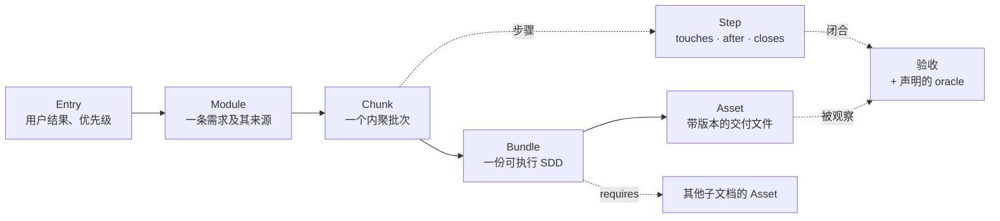
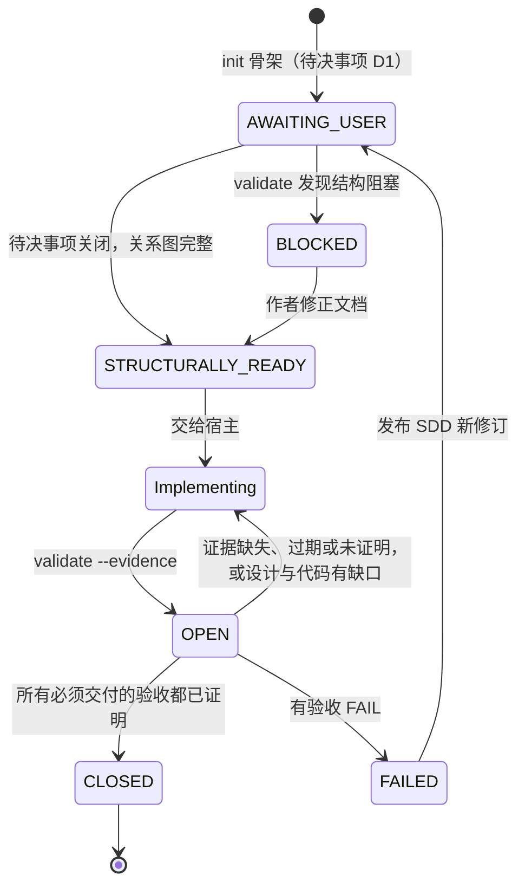
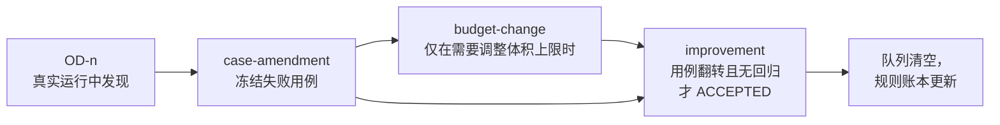

# create-sdd

[English](README.md) | **简体中文**

create-sdd 是一个 agent skill，把一个需求变成**编码 agent 能直接实施、机器能检查的软件设计文档（SDD）**。它负责编写、重构、合并或审计 `sdd/v2` 文档，写好的文档**直接交给你的编码宿主**（Claude Code、Codex 或任何其他 agent）。宿主实施后提交证据，`validate --evidence` 判断交付是否已收敛到设计。

本文介绍这个 skill 的用法和设计。[SKILL.md](SKILL.md) 是规范契约，两者不一致时以 SKILL.md 为准。

<p align="center">
  
</p>

| 能力 | 分数 | 依据 |
| --- | --- | --- |
| 可实施性 | 9 | 紧凑的交接：阅读顺序、带涉及文件的有序任务、MVP 任务集、按 Bundle 切分的执行切片 |
| 需求可追溯 | 9 | 每条必须交付的需求都经 Module、Chunk、Bundle 连到一个可观察的验收及其声明的 oracle |
| 收敛可验证 | 9 | 证据报告、按 commit 核验的因果证明、`--replay` 消融重跑，以及用于既有性质的 `preserve` 分类 |
| 设计缺陷检出 | 6 | 结构检查是精确的；语义检查（验收质量、读取方、符号）是基于正则的提示 |
| 上下文效率 | 8 | 宿主只读一个子文档和它的直接依赖；可推导的 Meta 让索引保持简短 |
| 仓库适配 | 8 | `AGENTS.md` 与原则文件、仓库 preset、可共享的 preset 包、自定义 `init` 模板 |
| 宿主中立 | 8 | 适用于 Claude Code、Codex 或任何能读取 skill 目录的 agent；脚本依赖 Bun |
| 上手成本 | 6 | 概念较多，且必须有 Bun；骨架和交接能缩短第一次上手 |

分数是作者对当前版本的自我评估，满分 10，越高越好（上手成本一项同样是越高越容易）。

---

## 快速开始

**安装。** 一条命令即可：先把 skill 克隆到 `~/.create-sdd`（只克隆一份），再链接到你用 `--host` 指定的每个编码 agent 的 skill 目录。用你手边已有的运行器即可，它们执行的都是同一个安装脚本：

```bash
curl -fsSL https://raw.githubusercontent.com/migaia/sdd-generate/main/install.sh | bash -s -- --host claude --host codex
```

```bash
npx @migaia/sdd-generate --host claude --host codex
```

```bash
pnpm dlx @migaia/sdd-generate --host claude,codex
```

```bash
bunx @migaia/sdd-generate --host claude,codex
```

```bash
aubx @migaia/sdd-generate --host claude,codex
```

`--host` 可以重复，也接受逗号分隔的列表；直接写 id（`bash -s -- claude codex`）同样可以。不经过 npm 仓库时，`npx github:migaia/sdd-generate --host claude`（或 `pnpm dlx github:…`）会直接从 GitHub 运行安装脚本。

| Agent | 参数（别名） | skill 目录 |
| --- | --- | --- |
| Claude Code | `claude`（`claude-code`） | `~/.claude/skills`（`$CLAUDE_CONFIG_DIR`） |
| OpenAI Codex | `codex` | `~/.codex/skills`（`$CODEX_HOME`） |
| Cursor | `cursor` | `~/.cursor/skills` |
| GitHub Copilot（CLI、VS Code、JetBrains） | `copilot`（`github-copilot`） | `~/.copilot/skills` |
| OpenCode | `opencode` | `~/.config/opencode/skills` |
| Pi coding agent | `pi` | `~/.pi/agent/skills` |
| Kimi Code CLI | `kimi`（`kimi-code`） | `~/.kimi-code/skills`（`$KIMI_CODE_HOME`） |
| ZCode（智谱） | `zcode` | `~/.zcode/skills` |
| Devin for Terminal | `devin` | `~/.config/devin/skills` |
| TRAE | `trae` | `~/.trae/skills` |
| TRAE CN | `trae-cn` | `~/.trae-cn/skills` |
| 豆包 Doubao | `doubao` | `~/.doubao/skills` |
| Gemini CLI | `gemini` | `~/.gemini/skills` |
| Qwen Code | `qwen` | `~/.qwen/skills` |
| Windsurf | `windsurf` | `~/.codeium/windsurf/skills` |
| 任何读取通用 Agent Skills 目录的 agent | `agents`（`universal`） | `~/.agents/skills` |

- 再次运行同一条命令会更新这份克隆，所有已链接的 agent 随之一起更新。
- `--list` 打印上表，路径按你本机实际解析。
- `--ref <tag>` 安装指定版本。
- `--copy` 改为复制而不是链接，适用于不跟随软链接的 agent。
- 目标路径上已有的真实目录不会被删除，脚本会报告并跳过该 agent。
- 安装脚本需要 bash 和 git（Windows 请在 WSL 或 Git Bash 中运行）。skill 的脚本依赖 [Bun](https://bun.sh)，只用内置模块；只有 `type-probe.ts` 需要先 `bun install` 装上 TypeScript。

**调用。** 说明你要的结果并指明仓库：Claude Code 里用 `/create-sdd`，Codex 里用 `$create-sdd`。skill 会选择模式、写出文档，然后停在实施之前，除非你也要求了实施。

| 你想要 | 模式 | 结果 |
| --- | --- | --- |
| 一个功能或改动 | feature（默认） | `sdd/v2` 叶子文档 |
| 修一个 bug | bug（`intent: bug`） | 复现、根因和回归验收 |
| 判断一个想法值不值得做 | assessment | `sdd-assessment/v1`：go、no-go 或 reshape；go 会作为 SDD 的 Entry 种子 |
| 多个归属独立的结果 | program | `sdd-program/v2` 根文档，每个结果一个子 SDD |
| 审查已有 SDD 或其实现 | audit | 只给结论，除非要求否则不改写 |

**手动走一遍完整流程。** `$SKILL` 是安装路径（用安装脚本安装后为 `~/.create-sdd`），路径必须是绝对路径。

```bash
bun $SKILL/scripts/init.ts --kind feature --out /repo/docs/greeting.sdd.md
```

```bash
bun $SKILL/scripts/validate.ts validate --sdd /repo/docs/greeting.sdd.md
```

```bash
bun $SKILL/scripts/init.ts --kind evidence --sdd /repo/docs/greeting.sdd.md --out /repo/docs/greeting.evidence.json
```

```bash
bun $SKILL/scripts/validate.ts validate --sdd /repo/docs/greeting.sdd.md --evidence /repo/docs/greeting.evidence.json --replay
```

1. `init` 写出一个校验结果为 `AWAITING_USER` 的骨架。
2. 你（或 agent）替换占位内容，回答其中的待决事项。
3. `validate` 报告 `STRUCTURALLY_READY`，并返回宿主交接。
4. 宿主实施，每个步骤单独提交，提交信息带步骤 ID（`S2: add farewell`）。
5. 宿主填写 `init --kind evidence` 生成的证据报告。
6. `validate --evidence` 计算闭合结果。

## 平台

**Agent 宿主。** skill 与宿主无关。日常宿主是 Claude Code 和 Codex，任何能读取 skill 目录并运行 Bun 的 agent 用法都一样。没有交付控制器，没有租约，也没有固定的 agent 角色：SDD 和 `validate` 的交接就是设计与实施之间的全部接口。

**运行环境。** 所有脚本由 Bun 运行。证明和重跑只读 Git，从不写入。`--replay` 用 `git archive` 导出代码树，再用从仓库推导出的运行器（`bun test`、`vitest`、`jest`、`pytest`、`go test`）或 preset 指定的运行器执行声明的 oracle。

**产品与语言。** 设计阶段只在确实涉及时才加载事实指南：
- *平台：* 小程序、iOS/Android、Flutter、HarmonyOS（ArkTS）、桌面端、原生 SDK。
- *语言：* Rust、Go、Python、Bun/Node、JVM。
- *专题：* UI 体验契约、内容站点、TypeScript 工具链、core-and-adapter 架构。

[references/loading.md](references/loading.md) 列出了各个条件分别对应哪份指南。

---

## 设计思想

### 设计要优化什么

SDD 的读者是负责实施的 agent。文档的写法要让它读更少的上下文、做更少的隐含决定，能顺着每条需求经过步骤找到验收，并找到每个受支持边界的负责方。由此得出五条原则：

- **每个事实只有一个权威来源。** Markdown 正文是规范；JSON 索引只存 ID、路径、版本和关系。仓库约定和原则文件按路径引用，不复制。
- **固定的取舍顺序：** 可用与可实施 > 实测性能 > 功能广度 > 测试机制 >> 可选加固。只有当前需求或已发生的故障才能引入抽象和防御机制。
- **用户的范围是硬边界。** 测试服务于业务结果，本身不是交付物；顺带发现的缺陷只记录，不升级为必须交付的工作。
- **如实说明局限。** 每个结果都带 `evidence_limits`。结构就绪不能证明设计好，也不授予提交、合并或部署的权限。
- **有度量的改进。** skill 只通过记录在案的轮次变化，每一轮都要修复一个已冻结的失败用例（见 [skill 自身的生命周期](#skill-自身的生命周期)）。

### 六阶段

每份文档都按同样的顺序编写。这六个阶段是推理顺序，不是六次工具调用、回执或 agent 角色。每个阶段针对设计中一种具体的出错方式。


| 阶段 | 回答的问题 | 产出 | 防止 |
| --- | --- | --- | --- |
| **1 Harvest 采集** | 这里实际是什么情况？ | 事实分为 `USER_STATED`、`OBSERVED`、`INFERRED`、`ASSUMED` 四类（只有前两类是规范性的）；确定的仓库与输出路径；以路径登记的 `principles` | 对着想象中的代码、编造的负责方或命令做设计 |
| **2 Admit 准入** | 要什么结果、给谁、为什么？ | 按优先级排列、可独立验收的 Entry；可度量的成功标准；待决事项写成 `[NEEDS CLARIFICATION: D1 …]` 并一次问完；决定用一份 SDD 还是 program | 范围蔓延；问题还没定就先做技术决定 |
| **3 Design 设计** | 在原则约束下怎么做？ | 规范行为、带 `touches` 的步骤、生产方与消费方接口、受支持的失败，以及每个改动边界唯一的负责方 | 一个边界两个负责方；宿主不得不自己补的步骤 |
| **4 Verify 验证** | 缺了它，我们怎么发现？ | 每条必须交付的需求都有一个 Given/When/Then 或命令形式的验收，决定性测试写进 `oracles`，并处理掉验收质量候选项 | 在旧代码上也能通过的验收；观察不到的断言 |
| **5 Decompose 分解** | 什么顺序？哪些能并行？ | 五 Meta 图；按真实依赖排序的批次；并行波次由推导得出，从不手工标注 | 手工维护、逐渐偏离设计的任务清单 |
| **6 Report 报告** | 宿主能依赖什么？ | 运行一次 `validate`，对结构看不到的问题做语义复核，交出带阻塞项、待决事项和证据局限的交接 | 在没运行的检查上宣称就绪 |

bug 修复走同样的六阶段，另加复现、根因，以及修复前必须失败的 `regression` 验收。assessment 只走 Harvest 和 Admit，然后给出 go、no-go 或 reshape。

### 五 Meta

五个 Meta 是从用户要的结果到最终交付文件之间的**关系图**。它们不是五个文档层级，也不是一套执行角色；每个 Meta 都指回正文里的规范锚点。



| Meta | 承载 | 规则 |
| --- | --- | --- |
| **Entry** | 带优先级（`P1`、`P2`…）的用户故事 | 出现的最高优先级即 MVP；交接会算出闭合 MVP 所需的最小任务集 |
| **Module** | 一条需求在其权威来源处的位置（`source_id`），以及它的原始身份（`origin`） | SDD 被拆分或合并时，需求身份保持不变 |
| **Chunk** | 一个步骤批次及它服务的 Module | 按批次依赖分层，得出推导的并行波次 |
| **Bundle** | 一份可执行 SDD：它的 Chunk、`reads`，以及它 `requires` 的 Asset | 宿主领取的执行单元；`requires` 让跨子文档依赖变得具体 |
| **Asset** | 带版本的交付文件或目录、生产它的 Bundle，以及观察它的验收 | 只对应真实产出，不为没有产出的工作编造 |

每条必须交付的需求都要经过 Module、Chunk、Bundle 连到一个可观察的验收，否则 `validate` 以 `SDD_V2_MUST_SHIP_CHAIN_INCOMPLETE` 阻塞。单文档叶子省略的 Meta 类别会自动推导（`M:R1`、`K:C1`、`B:self`、`E:self`）。program 根文档也可以省略子文档的 Module、Chunk、Bundle（`M:<child>:<R>`、`K:<child>:<C>`、`B:<child>`），子文档改动时不必再手抄根索引。只需声明真正带来信息的部分：带优先级的 Entry 和实际交付的 Asset。

### 生命周期

SDD 的生命周期从骨架一直走到交付闭合，每一次状态转换都由检查决定，而不是由某个人声称。



- **成熟度。** `validate` 返回 `BLOCKED`、`AWAITING_USER`（还有未关闭的 `[NEEDS CLARIFICATION]` 待决事项）或 `STRUCTURALLY_READY`。骨架总是从 `AWAITING_USER` 开始，因此不可能被当作完成的设计交出去。
- **交接。** 宿主拿到：
  - 根文档摘要，以及目标子文档和它的直接依赖；
  - 阅读顺序；
  - 带涉及文件和安全并行度的有序 `tasks`；
  - MVP 任务集；
  - 提示性的 `candidates`。
- **证据。** 宿主在 SDD 之外写一份 `sdd-evidence/v1` 报告，针对 SDD 当前的 `id@revision`，每个验收一行。对应其他修订的报告视为过期。
- **证明。** 只有一行 PASS，只能说明检查通过了。
  - *变更验收*要证明同一条命令在 base commit 上失败、在 change 上通过；base 必须是 change 的祖先，而且改动必须涉及实现该验收的文件。
  - *保持验收*列在 `preserve` 里，针对改动前已成立、改动后仍须成立的性质，例如 golden 等价或公开面不变。它的证明是 base PASS、change PASS，绝不伪造一次失败。
  - 未列入 `preserve` 的验收报告 base PASS，或列入的验收报告 base FAIL，闭合都保持 `OPEN`。
- **重跑。** `--replay` 不再信任宿主的运行结果，而是在导出的代码树里亲自运行声明的 oracle：
  - 在 base 上必须失败；
  - 在 change 上必须通过；
  - 在 change 上只回退这条需求的提交后，必须再次失败（消融）。
- **修订。** 出现 FAIL 或期望变化时，发布 SDD 的新修订，生命周期从文档重新开始。


### skill 自身的生命周期

检查规则本身也有生命周期，只有真实运行证明需要时才会改变。



1. 真实交付发现、而检查漏掉的缺陷，记录为 `rsi/observed-defects.md` 里的 `OD-n` 条目。
2. 一个 `case-amendment` 轮次为它冻结一个失败用例。
3. 如果需要调整体积预算，另开一个 `budget-change` 轮次，记录实测需要。
4. `improvement` 轮次只有在冻结用例翻转、且此前所有用例都没有回归时，才会 `ACCEPTED`。
5. 每条新规则都要登记它取代了什么、反例、适用范围和取舍。

---

## 机制

**`sdd/v2` 契约。** 文档由 Markdown 正文加一个位于 `<!-- sdd-contract:start -->` 与 `<!-- sdd-contract:end -->` 之间的紧凑 JSON 索引组成。索引包含需求、批次、步骤、验收、`oracles`、`writes`、Meta、`exports`/`consumes`、`regression`、`preserve` 和未决的用户决定。每个 ID 必须在正文里恰好定义一次。（[契约](references/v2-contract.md)）

**`validate` 交接。** 一条命令同时完成结构检查并输出宿主交接。交接包含已解析的路径、阅读顺序、有序 `tasks`、推导的 `waves`、MVP 及其最小任务集、执行切片（Chunk、Module、所需与产出的 Asset）以及 `evidence_limits`。

**提示性候选项。** 有些发现只作提示而不阻塞，因为正则表达式无法判定语义。它们分为五类：
- *读取方：* 断言错误文本的测试，或依赖类结构的代码。
- *符号：* 步骤里调用、却在自有源码中找不到声明的函数。
- *边界：* 被 git 忽略的输入，以及归其他 SDD 所有的写入。
- *前向依赖。*
- *验收质量：*
  - 未覆盖的结果；
  - 区分不了数量词的夹具；
  - 低于公开边界的 oracle；
  - 缺失的不变量或接口面清单；
  - 观察不到的断言对象；
  - 被承诺不变的测试仍在断言已删除的导出；
  - 未标记的保持验收；
  - 以及其他。

preset 可以把任何候选项升级为阻塞项。

**闭合。** `validate --evidence` 对每个验收检查：
- PASS 行是否运行了声明的 oracle；
- 按 commit 核验的证明及其因果差异；
- 承诺的文件和 Asset 在报告的 commit 上是否存在；
- 每条必须交付的需求是否至少改动了一个实现文件。

结果是 `CLOSED`、`OPEN` 或 `FAILED`，同时给出 `behaviour_proven` 和 `mvp_closed`。

**Program。** 当多个独立结果有稳定的负责方、拆分确实能缩小上下文时，才使用 program。它是一个很浅的 `sdd-program/v2` 根文档：目标、共享约束、子文档、依赖、Meta 图和整体验收。子文档之间的写入边界会做冲突检查，子文档分层后成为 `parallel_children`。（[multi-SDD](references/v2-program.md)）

**Preset 与 `init`。** `.create-sdd/preset.json` 让仓库声明自己的规则，而不用改 skill：
- 必需的原则文件和额外章节；
- 要升级为阻塞项的候选项；
- 重跑时使用的运行器；
- `init` 的自定义模板。

`preset.ts pack` 可以把 preset 打包，供其他仓库 `extends`。（[preset](references/v2-presets.md)）

**自我改进账本。** `rsi/` 保存：
- 由源码推导的规则目录（`rules.json`）；
- 体积上限及每次调高的记录（`budget.json`）；
- 每条规则的依据（`supersession.json`）；
- 对休眠规则的处置决定（`dispositions.json`）；
- 每一轮的记录（`rounds/`）。

## 命令

在任意目录运行 `bun <create-sdd-root>/scripts/<script>`；参数说明写在各脚本的文件头里。

| 命令 | 用途 |
| --- | --- |
| `init.ts --kind feature\|bug\|assessment\|program --out <abs.md>` | 写出一个校验为 `AWAITING_USER` 的骨架；从不覆盖已有文件，结果无法通过校验时什么也不写 |
| `init.ts --kind evidence --sdd <abs SDD> --out <abs.json>` | 写出供宿主填写的证据报告（保持验收预填 PASS 基线） |
| `init.ts ... --branch [name] --oracle-stubs`、`init.ts --kind oracles --sdd <SDD>` | 先切出分支；为缺失的测试 oracle 写出会失败的占位测试 |
| `preset.ts pack --repository <root> --out <dir>` | 把仓库的 preset 打包，供其他仓库 `extends` |
| `validate.ts validate --sdd <abs SDD> [--repository <abs root>]` | 结构检查并输出宿主交接 |
| `validate.ts validate --sdd <SDD> --evidence <report.json> [--replay]` | 收敛检查（`closure`） |
| `validate.ts validate-draft --draft-file <path>` | 在写入文档之前做同样的检查 |
| `type-probe.ts check --sdd <SDD>` | 可选：对导出的 TypeScript 代码块做类型检查 |

## 检查不能证明什么

结构、证据链接和重跑都不能证明设计是好的、oracle 覆盖了需求的全部行为，也不能证明任何 agent 读过这些指引。设计就绪的 SDD 不授予运行测试、提交、合并或部署的权限。请按字面理解每个结果里的 `evidence_limits`。

## 目录结构

- [SKILL.md](SKILL.md)：规范性的 skill 契约。
- [references/v2-contract.md](references/v2-contract.md)、[v2-authoring.md](references/v2-authoring.md)、[v2-program.md](references/v2-program.md)、[v2-presets.md](references/v2-presets.md)：v2 格式、各阶段实践、多 SDD program、preset 与 `init`。
- [references/loading.md](references/loading.md)：某个平台、语言或诊断该读哪份指南。
- `scripts/`：`validate.ts`、`init.ts`、`preset.ts`、`type-probe.ts`、`rsi.ts`，以及 `scripts/validator/` 下的校验器。
- `cases/`：冻结的缺陷用例及夹具；`tests/`：逻辑测试（`bun test tests`）。
- `rsi/`：skill 自身的改进账本。
- `assets/`：能力图。
- `install.sh`：安装脚本；`bin/sdd-generate.mjs` 让 `npx`、`pnpm dlx`、`bunx`、`aubx` 调用它。

## 维护本 skill

skill 只通过记录在案的轮次改进自己（[行为评估](references/behavior-evaluation.md)）：

- 把真实运行发现、而检查漏掉的缺陷，记为 [rsi/observed-defects.md](rsi/observed-defects.md) 里的 `OD-<n>` 条目。这个文件是队列：每次更新都要结算全部条目（`rsi.ts settle`），关闭轮次时归档。
- `bun scripts/rsi.ts update` 给出待办。改动以轮次进行：
  - `case-amendment` 冻结失败用例；
  - `budget-change` 带理由调整体积上限；
  - `improvement` 做修复，只有冻结用例翻转且无回归时才会被接受；
  - `consolidation` 精简。
- 完成改动前运行 `bun test tests`、`bun run typecheck`、`bun run lint` 和 `bun scripts/rsi.ts suite`。

## 许可证

[MIT](LICENSE) © 2026 Kaeo
